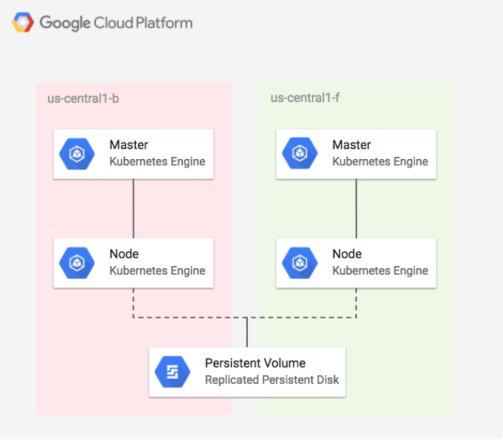

# Using Kubernetes Engine to Deploy Apps with Regional Persistent Disks

## Keyword
`regional cluste`, `Helm`  
`PersistentVolumeClaim`, `StorageClass`  
`WordPress`  

## Summary
- regional cluster(지역 클러스터)를 만들고 region 안에서 persistent volume을 공유하는 아키텍처 설계

~~~bash
# regional cluster 만들기
CLUSTER_VERSION=$(gcloud container get-server-config --region us-west1 --format='value(validMasterVersions[0])')
export CLOUDSDK_CONTAINER_USE_V1_API_CLIENT=false

# repd 클러스터를 만든다
gcloud container clusters create repd \
  --cluster-version=${CLUSTER_VERSION} \
  --machine-type=n1-standard-4 \
  --region=us-west1 \
  --num-nodes=1 \
  --node-locations=us-west1-a,us-west1-b,us-west1-c
~~~

- WordPress를 Helm을 통해서 설치할 때 `persistence.storageClass=repd-west1-a-b-c` 옵션을 주고 설치한다.
~~~bash
# Helm 다운로드
curl https://raw.githubusercontent.com/kubernetes/helm/master/scripts/get > get_helm.sh
chmod 700 get_helm.sh
./get_helm.sh

# tiller 라는 이름으로 서비스 계정을 생성하고 cluster-admin 역할을 바인딩해준다.
kubectl create serviceaccount tiller --namespace kube-system

kubectl create clusterrolebinding tiller-cluster-rule \
  --clusterrole=cluster-admin \
  --serviceaccount=kube-system:tiller

# Helm init
helm init --service-account=tiller
until (helm version --tiller-connection-timeout=1 >/dev/null 2>&1); do echo "Waiting for tiller install..."; sleep 2; done && echo "Helm install complete"

# StorageClass 추가
# us-west1-a, us-west1-b, us-west1-c에 복제된 PersistentVolume을 제공
kubectl apply -f - <<EOF
kind: StorageClass
apiVersion: storage.k8s.io/v1
metadata:
  name: repd-west1-a-b-c
provisioner: kubernetes.io/gce-pd
parameters:
  type: pd-standard
  replication-type: regional-pd
  zones: us-west1-a, us-west1-b, us-west1-c
EOF

# Create Persistent Volume Claims
# mariaDB용 8G(standard), wordpress용 200G (repd-west1-a-b-c)
kubectl apply -f - <<EOF
kind: PersistentVolumeClaim
apiVersion: v1
metadata:
  name: data-wp-repd-mariadb-0
  namespace: default
  labels:
    app: mariadb
    component: master
    release: wp-repd
spec:
  accessModes:
    - ReadOnlyMany
  resources:
    requests:
      storage: 8Gi
  storageClassName: standard
EOF

kubectl apply -f - <<EOF
kind: PersistentVolumeClaim
apiVersion: v1
metadata:
  name: wp-repd-wordpress
  namespace: default
  labels:
    app: wp-repd-wordpress
    chart: wordpress-5.7.1
    heritage: Tiller
    release: wp-repd
spec:
  accessModes:
    - ReadOnlyMany
  resources:
    requests:
      storage: 200Gi
  storageClassName: repd-west1-a-b-c
EOF

# 확인
kubectl get storageclass
kubectl get persistentvolumeclaims

# Deploy WordPress
helm install --name wp-repd \
  --set smtpHost= --set smtpPort= --set smtpUser= \
  --set smtpPassword= --set smtpUsername= --set smtpProtocol= \
  --set persistence.storageClass=repd-west1-a-b-c \
  --set persistence.existingClaim=wp-repd-wordpress \
  --set persistence.accessMode=ReadOnlyMany \
  stable/wordpress

# 확인
kubectl get pods

# external IP 얻기
while [[ -z $SERVICE_IP ]]; do SERVICE_IP=$(kubectl get svc wp-repd-wordpress -o jsonpath='{.status.loadBalancer.ingress[].ip}'); echo "Waiting for service external IP..."; sleep 2; done; echo http://$SERVICE_IP/admin

# persistent disk 확인
while [[ -z $PV ]]; do PV=$(kubectl get pvc wp-repd-wordpress -o jsonpath='{.spec.volumeName}'); echo "Waiting for PV..."; sleep 2; done

kubectl describe pv $PV

# username과 password를 secret으로 부터 얻음
cat - <<EOF
Username: user
Password: $(kubectl get secret --namespace default wp-repd-wordpress -o jsonpath="{.data.wordpress-password}" | base64 --decode)
EOF
~~~
- 노드를 삭제하는 방법으로 zone failure를 시뮬레이션 하고 WordPress 앱과 데이터가 복제된 다른 zone으로이동하는 것을 확인하는 예제
~~~bash
# Simulating a zone failure
NODE=$(kubectl get pods -l app=wp-repd-wordpress -o jsonpath='{.items..spec.nodeName}')
ZONE=$(kubectl get node $NODE -o jsonpath="{.metadata.labels['failure-domain\.beta\.kubernetes\.io/zone']}")
IG=$(gcloud compute instance-groups list --filter="name~gke-repd-default-pool zone:(${ZONE})" --format='value(name)')
echo "Pod is currently on node ${NODE}"
echo "Instance group to delete: ${IG} for zone: ${ZONE}"

# 노드 삭제 전에 Node가 us-west1-c로 표시되는 것을 확인
kubectl get pods -l app=wp-repd-wordpress -o wide

# 노드 삭제
gcloud compute instance-groups managed delete ${IG} --zone ${ZONE}

# 삭제 후 다른 zone으로 들어가있는 것을 확인
kubectl get pods -l app=wp-repd-wordpress -o wide
echo http://$SERVICE_IP/admin
~~~

## Helm
- kubernetes package manager
- `kubectl get persistent volumeclaims`
~~~bash
NAME                     STATUS   VOLUME                                     CAPACITY   ACCESS MODES   STORAGECLASS       AGE
data-wp-repd-mariadb-0   Bound    pvc-60b2f207-84f2-11e9-a6b2-42010a8a00b9   8Gi        ROX            standard           9m58s
wp-repd-wordpress        Bound    pvc-686a80ee-84f2-11e9-bb86-42010a8a0062   200Gi      ROX            repd-west1-a-b-c   9m45s
~~~
> Helm is a tool for managing Kubernetes charts. `Charts` are packages of `pre-configured` Kubernetes resources.

## Discussion
- zone failure를 시뮬레이션 하는 방법이 인상적
- kubectl get pods -l app=wp-repd-wordpress -o wide
- deployment를 직접 만들어서 적용하지 않고 helm 패키지 매니저를 사용하는 부분에 대한 장점이 설명되어있다면 더 좋았을 것