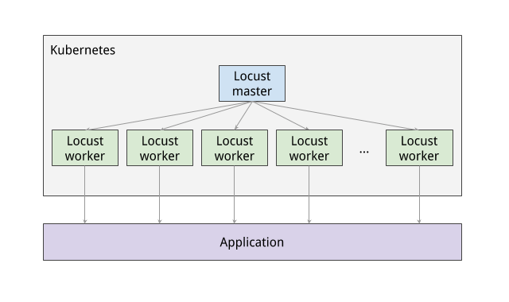

# Distributed Load Testing Using Kubernetes

## Keyword
`load testing`, `Locust`, `app engine` 

## Summary
- 여러 컨테이너를 사용하여 간단한 REST API에 대한 부하 테스트 트래픽을 생성하는 예제
- 노드 5개에 replica 20개 설정하여 부하를 생성

- `./sample-webapp` sample app으로 flask를 사용한 rest api 서비스를 앱 엔진에 배포
- `./kubernetes-config` 에 
> https://github.com/GoogleCloudPlatform/distributed-load-testing-using-kubernetes

~~~bash
# Set project and zone
PROJECT=$(gcloud config get-value project)
REGION=us-central1
ZONE=${REGION}-a
CLUSTER=gke-load-test
TARGET=${PROJECT}.appspot.com
gcloud config set compute/region $REGION
gcloud config set compute/zone $ZONE

# Build a Docker image 
git clone https://github.com/GoogleCloudPlatform/distributed-load-testing-using-kubernetes.git
cd distributed-load-testing-using-kubernetes/
gcloud builds submit --tag gcr.io/$PROJECT/locust-tasks:latest docker-image/.

# 앱 엔진을 사용해서 배포
gcloud app deploy sample-webapp/app.yaml

# Kubernetes Cluster 배포
gcloud container clusters create $CLUSTER \
  --zone $ZONE \
  --num-nodes=5

# master
sed -i -e "s/\[TARGET_HOST\]/$TARGET/g" kubernetes-config/locust-master-controller.yaml
sed -i -e "s/\[TARGET_HOST\]/$TARGET/g" kubernetes-config/locust-worker-controller.yaml
sed -i -e "s/\[PROJECT_ID\]/$PROJECT/g" kubernetes-config/locust-master-controller.yaml
sed -i -e "s/\[PROJECT_ID\]/$PROJECT/g" kubernetes-config/locust-worker-controller.yaml

kubectl apply -f kubernetes-config/locust-master-controller.yaml
kubectl apply -f kubernetes-config/locust-master-service.yaml

kubectl get pods -l app=locust-master
kubectl get svc locust-master

# workers를 만들고 replica를 20으로 늘려본다
kubectl apply -f kubernetes-config/locust-worker-controller.yaml
kubectl get pods -l app=locust-worker
kubectl scale deployment/locust-worker --replicas=20

kubectl get pods -l app=locust-worker

# Locust 테스트 실행
EXTERNAL_IP=$(kubectl get svc locust-master -o yaml | grep ip | awk -F": " '{print $NF}')
echo http://$EXTERNAL_IP:8089
~~~
- sample-webapp/app.yaml
~~~yaml
runtime: python37
instance_class: F2
handlers:
- url: /.*
  script: auto
~~~
> https://github.com/GoogleCloudPlatform/distributed-load-testing-using-kubernetes/blob/master/sample-webapp/app.yaml

## Locust
-  A distributed, Python-based load testing tool that is capable of distributing requests across multiple target paths
- Locust master port: 8089(web interface), 5557, 5558 (worker 통신)

## Load Testing
- 부하 테스트: 애플리케이션을 프로덕션 환경으로 배포하기 전에 사용자 및 기기의 동작을 적절히 시뮬레이션하여 발생 가능한 시스템 병목현상을 모두 발견하고 이해하는 것
- 그러나 전용 테스트 인프라는 1회성으로 필요하거나 유지보수, 비용이 많이 드는 작업일 수 있기 때문에 쿠버네티스를 사용하여 본다.
> https://cloud.google.com/solutions/distributed-load-testing-using-kubernetes

## Discussion
- 응용하면 게임이나 IoT와 같은 복잡한 부하테스트 시나리오도 작성 가능
